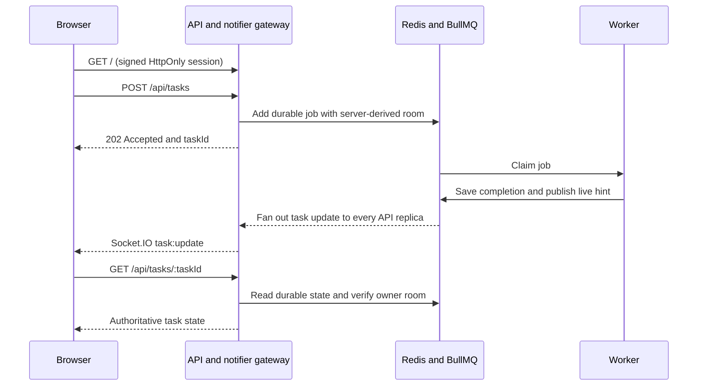

# Sample Notifier Service

A modern tutorial for a durable background-job notification pattern:

1. a browser asks an API to start work;
2. the API returns immediately with a task ID;
3. a separate worker processes the durable job;
4. Socket.IO provides a fast, targeted update; and
5. the browser reads saved task state after a reload or missed event.

The original 2016 demo made this flow unusually easy to see. This replacement
keeps that teaching intent while fixing its clean-clone, authentication,
delivery, scaling, and dependency problems.

## Run the lab

Requirements:

- Docker with Docker Compose v2
- a browser

```sh
git clone https://github.com/pulkitsinghal/sample-notifier-service.git
cd sample-notifier-service
docker compose up --build
```

Open <http://localhost:3000>, run a task, and watch it move from queued to
running to completed.

Stop the lab with:

```sh
docker compose down
```

The named volume keeps queued jobs and recent results between ordinary
restarts. Nothing in this repository deploys cloud infrastructure or invokes a
paid service.

## What changed

| Concern | 2016 demo | Replacement |
| --- | --- | --- |
| Runtime | EOL Node 4, Redis 2.8, legacy Compose v2 | Node 24 LTS, pinned packages and images, current Compose Specification |
| Clean start | Dockerfiles did not install dependencies | Multi-stage image uses `npm ci` and a lockfile |
| Job delivery | Redis Pub/Sub could lose work while the worker was offline | BullMQ keeps jobs in Redis and retries failures with backoff |
| Browser delivery | Result existed only as a socket event | Socket event is a fast hint; `GET /api/tasks/:id` is the recoverable truth |
| Identity | Socket ID was treated as a short-lived password | Signed HttpOnly session cookie maps to a server-only notification room |
| Internal notify API | Public, unauthenticated `/notify` endpoint | Worker publishes an internal event; browsers cannot choose the target room |
| Multiple API instances | Each notifier owned an isolated socket map | Every API replica subscribes to completion events and emits to its local room |
| Exposure | Redis and notifier ports were published to the host | Only the web API binds to `127.0.0.1`; Redis stays on the container network |
| Safety | No validation, security headers, health checks, or graceful stop | Bounded JSON, exact-origin writes, Helmet CSP, health endpoints, shutdown handlers |
| Verification | Test scripts intentionally failed | Unit tests plus a two-API/one-worker Redis integration test |

See [the architectural analysis](docs/architecture.md) for the evidence and
tradeoffs behind each change.

## Architecture



The queue and saved result carry the reliability requirement. Redis Pub/Sub
and Socket.IO carry only the low-latency update. Losing that update does not
lose the result.

## Learn by experimenting

The [guided tutorial](docs/tutorial.md) walks through:

- the normal request, queue, worker, and notification path;
- a worker outage;
- a browser disconnect and result recovery;
- the cross-instance integration test;
- the exact security boundary of the anonymous demo session; and
- production decisions intentionally left out of a local sample.

## Validate

Unit tests need Node 24:

```sh
npm ci
npm test
```

The integration suite needs a real Redis-compatible server. The reproducible
container path builds the test image, starts Redis, and runs both suites:

```sh
docker compose --profile test run --build --rm test
docker compose down
```

The integration test starts two API instances, connects the browser client to
one, submits work to the other, receives the completion event, disconnects,
then proves that the saved result is still readable.

## Tutorial boundary

This is a local teaching system, not a production deployment template.

- The checked-in local secret is synthetic. Production must inject a strong
  secret from a secret manager.
- `NODE_ENV=production` enables the `Secure` cookie flag, so production also
  requires HTTPS and a correctly configured reverse proxy.
- The anonymous session isolates browser tabs for the demo; replace it with
  real application authentication and authorization for real users.
- Redis is intentionally not host-published. A production data service still
  needs network isolation, ACLs, TLS, backups, capacity limits, and monitoring.
- A real worker operation must be idempotent because durable queues can
  redeliver after failures.
- Task retention, deletion, rate limits, audit logs, and data classification
  depend on the actual product and cannot be chosen by a generic tutorial.
- Redis 8 is tri-licensed. This sample uses its unmodified official image for
  local development; an owner should select and review the applicable Redis
  license before redistribution or product use.

## Primary references

Design choices were checked against current primary documentation on
2026-07-27:

- [Node.js release status](https://nodejs.org/en/about/previous-releases)
- [Express security best practices](https://expressjs.com/en/advanced/best-practice-security/)
- [Socket.IO delivery guarantees](https://socket.io/docs/v4/delivery-guarantees/)
- [Socket.IO with multiple nodes](https://socket.io/docs/v4/using-multiple-nodes/)
- [Redis Pub/Sub delivery semantics](https://redis.io/docs/latest/develop/pubsub/)
- [Redis 8 licensing options](https://redis.io/legal/licenses/)
- [BullMQ retry behavior](https://docs.bullmq.io/guide/retrying-failing-jobs)
- [Docker Compose Specification](https://docs.docker.com/reference/compose-file/)
- [Docker build best practices](https://docs.docker.com/build/building/best-practices/)

## License

Apache-2.0. See [LICENSE](LICENSE).
